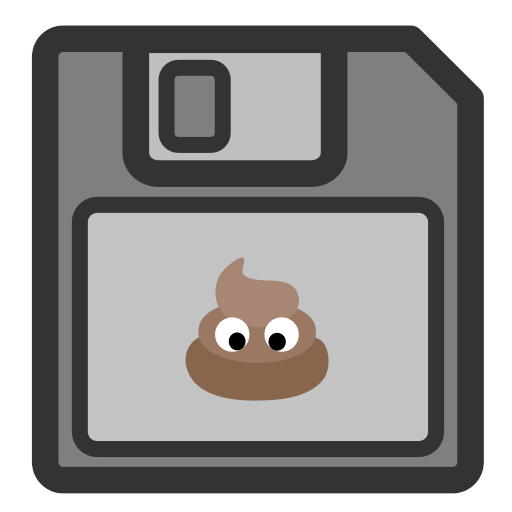

# BackupMyShit
<div>
<p style="float: right; margin: 0 0 20px 20px;"></p>
<p>Tired of games overwriting a savegame all the time and not having backups? <br>
The solution is this python script, which creates backups of your savegame every x minutes.</p>
</div>


## Requirements
If you want to get a windows notification after each backup you need to install winotify. `pip install winotify`

## Usage
```shell
python backup.py -f Filename [-p Path] [-t Interval] [-n]
python backup.py -h #Help page with explanation of parameters
```
Filename: The file or folder to backup.  
Path: The directory where to store your backups. By default the parent directory of the original file/folder.  
Interval: The time interval in minutes in which the backups should be created. By default 5 minutes.  
Use -n/--notification to get a windows notification after each backup.

In the target directory the 'Backups_dir' is created and contains all the backups.

To stop the script use `ctrl + c`.

## Future Ideas
- [x] Allow backup of whole directories
- [x] Windows notification for each created backup

### Credit
Credit for the repo name goes to [@EzErenEz](https://github.com/EzErenEz).